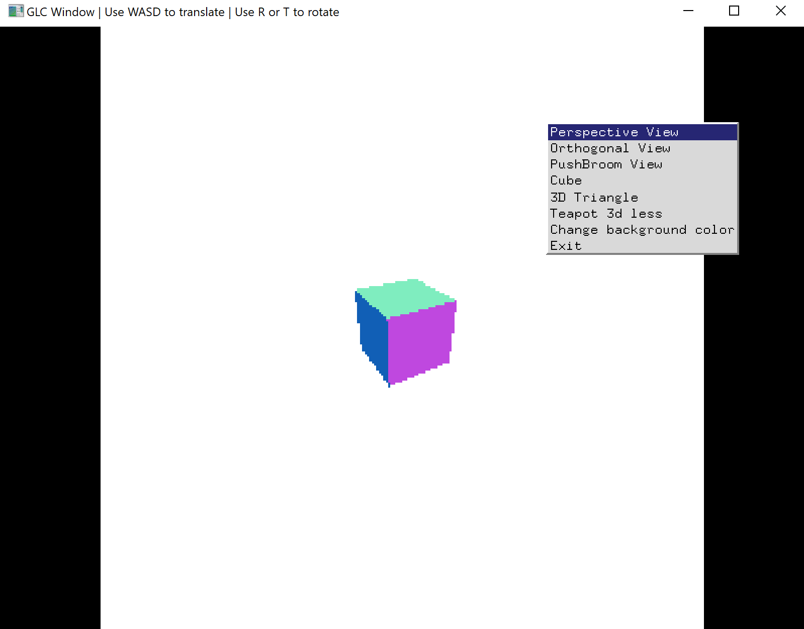
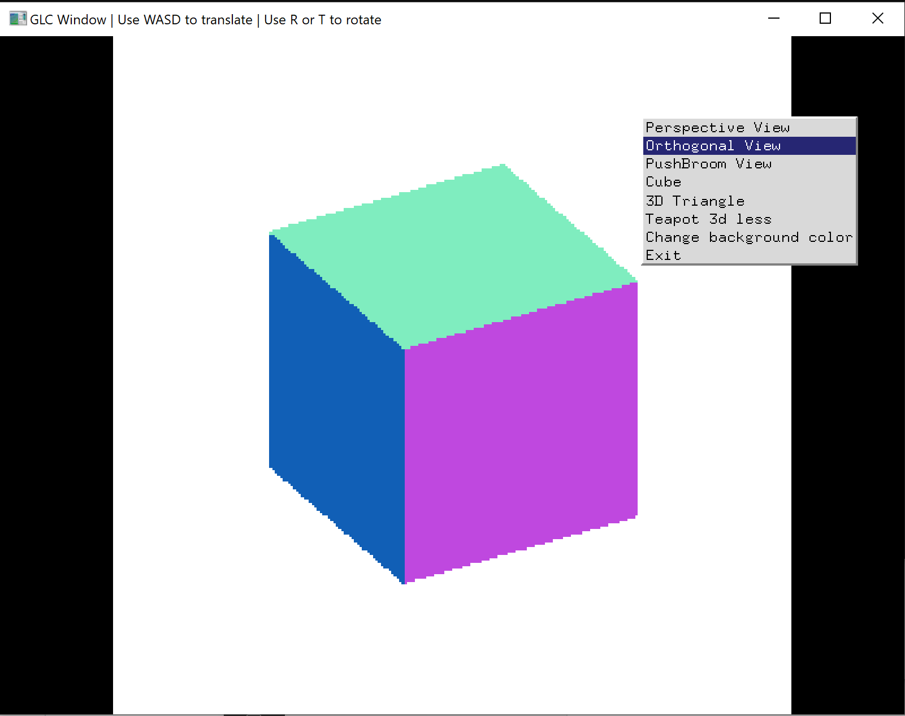
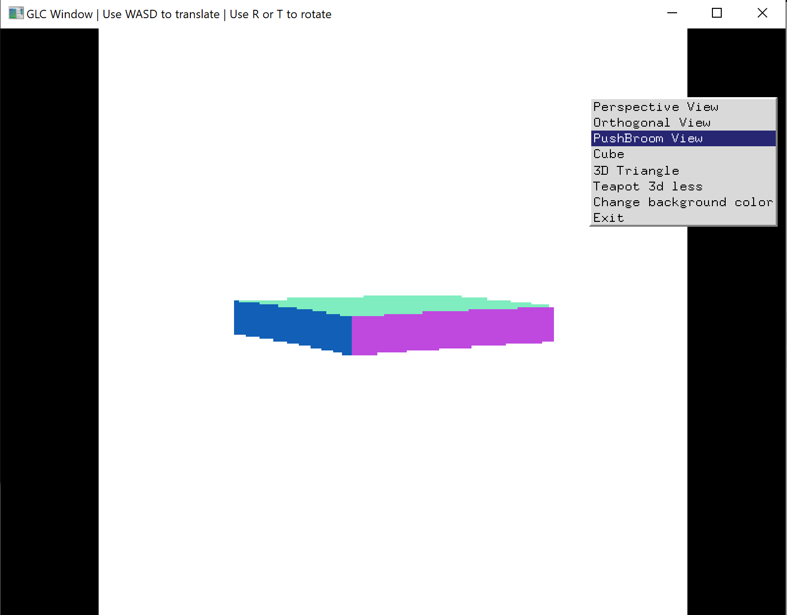
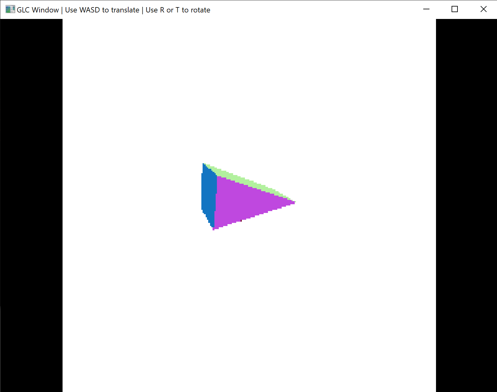
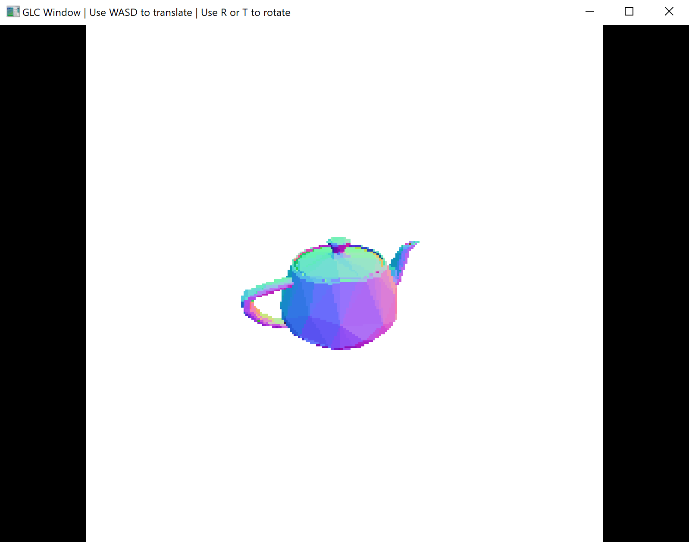

# GLC(Generl Linear Camera) Renderer

#### Based on the paper : [http://csbio.unc.edu/mcmillan/pubs/eccv2004_Yu.pdf]

##### Using Techniques:

1. GLC model generation (realized 3 types of camera models: perspective, orthogonal, pushbroom)
2. Ray Generation(GLC method) & Ray Casting: from camera model plane to objects(.obj file input)
3. Ray-Object Interaction
4. Rasterization (base on normal) 

##### Render Effect Images (256 * 256 size grid):

1. Cube in perspective projection

2.  Cube in orthogonal projection

3. Cube in pushbroom projection

4. Triangular prism (perspective)

5. Teapot (perspective)

